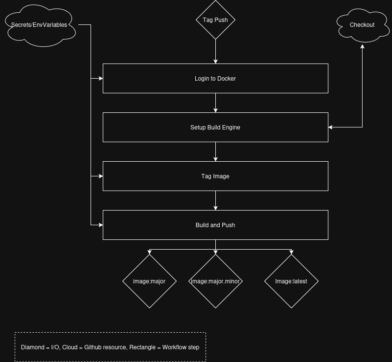

# Continuous Integration

## CI Project Overview
The goal of this project is to implement a continuous integration pipeline for a simple html website with semantic versioning of the Docker Repo based on Git Tagging. This project uses official github actions for github and docker to build, tag, and push the docker container from the repo's Dockerfile. 

## Web Service Container
Pulls the httpd official container and exposes my personal portfolio website on port 80.

### Website
The index of the website is an about me page. Across the top of the site is a nav bar with links to Home, Projects, and Resume. The homepage is the aboutme section, projects contains a gallery style set of links to my personal projects, and the resume opens my resume pdf. 

### Dockerfile
Pull from the httpd base image and copy web-content folder to the default directory served by apache.
- [DockerFile](Dockerfile)

### Dockerhub
*Instructions to build and push container to dockerhub (including create PAT && recomended PAT scope*
- Build image: `docker build . -t <tagname>`
- PAT Token:
    - Navigate to dockerhub -> account settings -> Personal Access Tokens
    - Generate a token, in this case reccomended just read and write so you can push and pull the repo.
    - Copy and store the key in a secure location
    - Run `docker login -u <username>`
    - Enter PAT token at prompt
- Push to docker hub: 
    - Build with repo tag: `docker build . -t malliasm/portfolio`
    - Push: `docker push malliasm/portfolio`

*Link to Dockerhub repo*: https://hub.docker.com/repository/docker/malliasm/portfolio/general

## Github Actions 
- Configure GitHub Repository Secrets
- How to create a PAT for authentication:
    - Go to settings > Personal Access Tokens
    - Select `Generate New Token`
    - Give it a descriptive name: `Github Docker Token and set permissions.
    - We want Github to be able to pull and make edits and push back. So we want Read Write permissions.
    - Navigate to your repo's setting under Security and Quality > Secrets and Variables > Actions > New Repository Secret
    - Make a secret for your username and token
- CI with GitHub Actions
    - Explanation of workflow trigger
        - The workflow triggers whenever a push is made to the main branch.
    - Explanation of workflow steps
        - First, the workflow logs in to dockerhub using the secret credentials
        - Then, it sets up the Docker Build engine. This allows for a more powerful build step rather then relying on the default driver. 
    - Explanation / highlight of values that need updated if used in a different repository
        - These values should all be fine in another repository if you use the same secret names and dockerhub path. No checkout is neccessary here since the build kit automatically uses the default context.
    - **Link** to workflow file: [Workflow](.github/workflows/WebDocker-CI.yml)
- Testing & Validating
    - How to test that your workflow did its tasking
        - Make a change to the website
        - Check Github Actions pane to see if the action succeeded. Check Dockerhub to verify the push was recieved. Verify further in the next step.
    - How to verify that the image in DockerHub works when a container is run using the image
        - Pull the docker repo and run the container. Check that your change is present. Test thoroughly - ideally you would automate some tests as well as some manual verification. 
    - Link to your DockerHub repository: [Repo](https://hub.docker.com/repository/docker/malliasm/portfolio/general)

## Semantic Versioning
Generating tags:
- view git tags:
    - `git tag`
- Generate tag:
    - `git tag <tagname>`
- Github Action
    - Workflow trigger:
        - This workflow triggers on a push of a tag in the form of v*.*.*
    - Steps:
        - Login to dockerhub
        - Setup the docker build engine (note this also checks out the repo)
        - Tag the image using metadata action
        - Build and push the image.
    - This version is also agnostic of the repository it is in. The only change that need be made is the name of the image placed after the username in the path for the repo, and that is only if you wish to use a different repo. That could also be broken out into an environment variable to make this workflow entirely agnostic. 
- Testing & Validating
    - Make a change to the site content
    - Commit and push a tag to the repo
    - Verify the action completes properly
    - Check dockerhub for the appropriate tags
    - Pull the image and check change is present. 
    - [Dockerhub Repo](https://hub.docker.com/repository/docker/malliasm/portfolio/tags)
    - Once again, ideally you would have a few automated tests that run here that pull the image and verify it runs properly. 

# Resources
Github Actions - These essentially amount to my entire resource pool when combined with Course Repo Info:
- Docker Build & Push: https://github.com/marketplace/actions/build-and-push-docker-images
- Docker Login: https://github.com/marketplace/actions/docker-login
- Docker Setup Buildx: https://github.com/marketplace/actions/docker-setup-buildx
- Docker Metadata: https://github.com/marketplace/actions/docker-metadata-action

Course Repo and Lecure Information